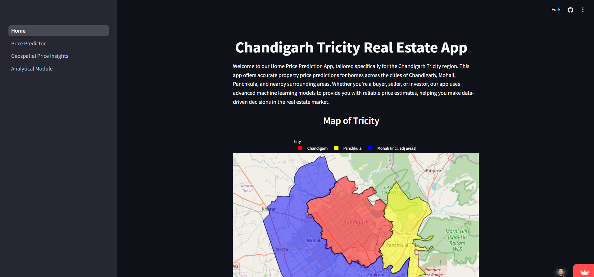

# Chandigarh Tricity Real Estate ML App

This application utilizes machine learning to predict house prices in the Chandigarh Tricity area, which encompasses Chandigarh, Mohali, Panchkula, and surrounding regions. The app is divided into two key modules: the Price Predictor Module and the Price Insights Module, offering accurate predictions and deep insights through geospatial analysis.

## Project Description

### Price Predictor Module

At the heart of the application is the house price prediction model, which utilizes the CatBoost algorithm. With an impressive R² score of 0.9615 and Mean Absolute Error (MAE) of 0.0915 Cr INR, the model ensures high accuracy in predicting house prices. The predictions are based on various critical features such as location, plot area, property type, and more. This module is designed to offer reliable price estimates, empowering users with data-driven insights when evaluating real estate properties.

### Price Insights Module

The Price Insights Module offers a powerful tool for geospatial analysis of house prices. Leveraging Plotly for visualization, it generates an interactive Choropleth map that illustrates price per square foot across different sectors in the Tricity region. This map enables users to explore price trends visually and interactively, offering valuable insights for real estate investments and pricing strategies. The module adds depth to the application by providing users with data-driven insights into local real estate market dynamics.

## Project Snapshots

<p align="Center"><strong>Home</strong></p>



<p align="Center"><strong>Price Predictor</strong></p>


<p align="Center"><strong>Geospatial Price Insights Module</strong></p>


<p align="Center"><strong>Analytical Module</strong></p>

<p align="center"></p>
<p align="center"></p>

## Run Locally

#### Clone the project

```bash
  git clone https://github.com/Anmol25/real_estate_app
```

#### Go to the project directory

```bash
  cd real_estate_app
```

#### Create a Virtual Environment (Optional but Recommended)

Create a virtual environment to isolate your project's dependencies:

```bash
  python -m venv venv
```

Activate the virtual environment:

 - For Windows:

```bash
  venv\Scripts\activate
```
- For macOS/Linux:
```bash
  venv/bin/activate
```

#### Install the Required Dependencies
Install the necessary packages listed in the requirements.txt file:
```bash
  pip install -r requirements.txt
```
#### Run the Streamlit App

Launch the Streamlit app by running the following command:
```bash
  streamlit run Home.py
```

#### Open in Your Browser
Once the app starts running, it will automatically open in your web browser. If not, go to the following URL:
```bash
  http://localhost:8501
```

## Authors

- [@Anmol25](https://github.com/Anmol25)

